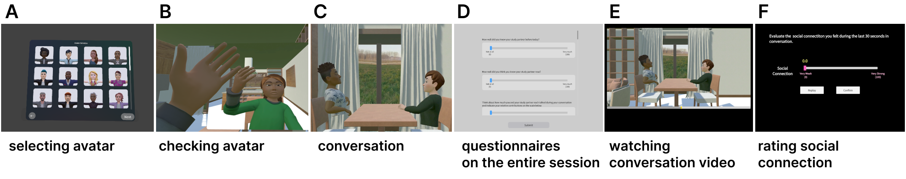

# Dyadic Conversation in Virtual Reality



This Unity project (version `2022.3.20f1`) enables dyadic conversations in virtual reality using the Meta Quest Pro and WebRTC communication. It is intended for local network use and includes optional monitoring and recording features.

## Overview

- **WebRTC-based VR communication** between two users.
- **Avatar selection and session participation**: `1 Conversation A` and `1 Conversation B` for each participant.
- **Optional monitoring** without VR device or avatar via the `1 Monitor` scene.
- **Video and audio recording** of conversations using OBS + NDI setup.
- **Survey integration** via the `2 PostConversation` scene.

## Requirements
- Two computers, each connected to a **Meta Quest Pro** and the same local router.
- (Optional) Monitoring computer on the same network.
- WebRTC **socket signaling server** running locally.
- Unity 2022.3.20f1 or later.

## Setup Instructions

### Network Configuration

- Connect all participant and monitor computers to the same router.
- On any computer (preferably the monitoring one), start the socket signaling server.

### VR App Launch

1. Launch `Conversation A` and `Conversation B` scenes on separate computers with Quest Pros.
2. Use the `Monitor` scene for non-VR observation or participation.

## Recording Setup (Optional)

> If you do not intend to record, this section can be skipped.

### Prerequisites

1. **Run the Socket Server**

   - Install **Node.js** from the official website: [https://nodejs.org/](https://nodejs.org/)
   - Open a terminal and navigate to the `util-signaling-server` directory.
   - Run the following command to install dependencies:
     ```
     npm install
     ```

2. **Install NDI Runtime**  
   Download and install from:  
   https://ndi.video/tech/ndi6/ and https://ndi.video/tools/download/

3. **Install OBS Studio**  
   https://obsproject.com/  
   Enable **recording mode** during setup.

4. **Install OBS-NDI Plugin**  
   https://github.com/DistroAV/DistroAV

### OBS Configuration

1. **Add NDI Source** in OBS:  
   - Add a new NDI Source in OBS.
   - You may need to launch the Unity project for the source to become visible.

2. **Set Hotkeys** for recording control:  
   - Go to `Settings > Hotkeys`
   - Assign `F9` to start recording, `F10` to stop.

3. **Audio Track Setup** for multi-track export:  
   - `Settings > Output > Recording`
   - Set format to `mkv`

4. **Vidieo Timestamp** for synchronizing pose data
    - In the top menu of OBS, go to Scripts, and add util-obs-timestamp/logger.py.
    - Choose an appropriate save path and file name for the timestamp log.
    - These timestamps can be used to synchronize recorded video with pose data collected within the Unity scene.

4. **Channel Assignment**:  
   - `Settings > Output > Recording`
   - Enable audio tracks 1, 2, and 3
   - Then return to the audio mixer and open the Advanced Audio Properties menu.
Assign Desktop Audio to tracks 1 and 2, and Microphone to tracks 1 and 3.
   - Confirm the file save path is accessible to Unity.
   - Click the gear icon on the audio mixer tab.
   - Assign desktop and microphone audio to different tracks.

## Usage Instructions

1. Launch the **socket server** on any machine in the local network.  
   Navigate to the `util-signaling-server` directory in the terminal and run `node index.js`.
   Alternatively, you can run `start.bat` to launch the server.
2. Start the corresponding VR app on each participant’s computer.
3. Press **R** in the Unity app to begin recording (OBS must be running).
4. Press **Q** in the Unity app to stop recording.
5. Press **3** in the Unity app to move to the post-conversation scene

## Post-Conversation Survey

To launch the post-session survey app:

- Run the `2 PostConversation` scene.
- The scene will automatically:
  - Convert video files,
  - Launch the session survey,
  - Launch the video-based survey.

> Before launching, verify that the `[1] Video Converter` GameObject has the correct path set to the video recording folder.

## Support

If you experience issues or want to test the upcoming standalone version of next version of this app (which removes the need for external server setup), contact:  
**Hyunchul Kim** – [hyunchul.kim@kaist.ac.kr](mailto:hyunchul.kim@kaist.ac.kr)
